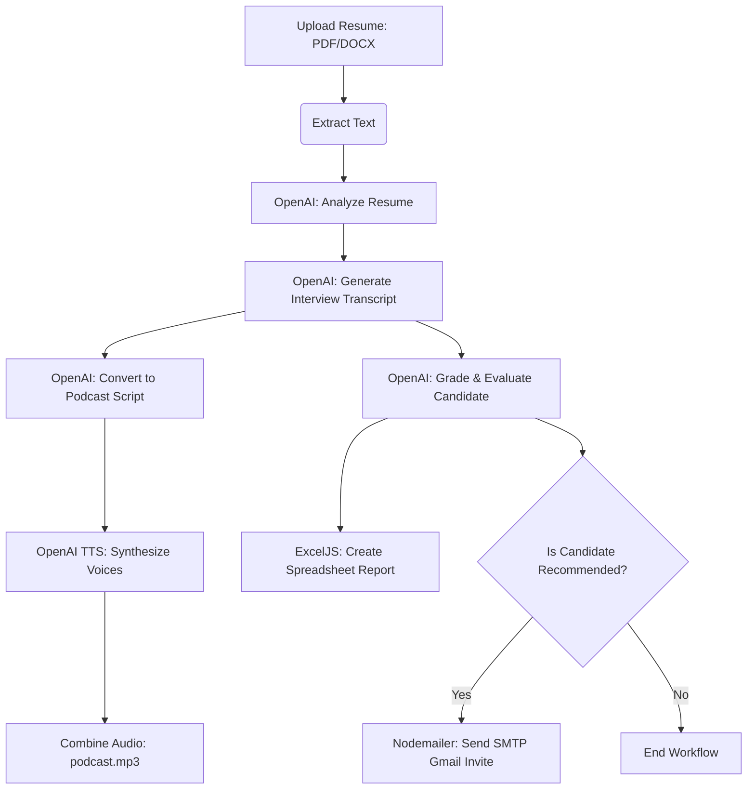

# Resume Evaluator API

A powerful Node.js and Express backend that automates the candidate screening process. This service parses resume documents (PDF & DOCX), generates mock interview transcripts, runs automated AI candidate evaluations, compiles detailed evaluation spreadsheets, generates podcast-style audio conversations of the interview using OpenAI Text-to-Speech (TTS), and automatically emails top candidates.

---

## Table of Contents

- [Features](#features)
- [System Architecture](#system-architecture)
- [Prerequisites](#prerequisites)
- [Installation & Setup](#installation--setup)
- [Environment Variables](#environment-variables)
- [API Endpoints](#api-endpoints)
- [Directory Structure](#directory-structure)
- [License](#license)

---

## Features

- **Document Text Extraction**: Extracts plain text from `.pdf` and `.docx` file formats (using `pdf-parse` and `mammoth`).
- **AI-Powered Profile Analysis**: Uses GPT-4o to analyze candidate resumes and output structured JSON containing the candidate's name, contact details, parsed skills, experience summary, strengths, and weaknesses.
- **Simulated Technical Interviews**: Automatically drafts a realistic 20-minute mock technical interview transcript tailored to the candidate's actual background and skills.
- **AI Podcast Generation**: Converts the interview transcript into a structured podcast script and synthesizes audio sequentially using OpenAI TTS (featuring two distinct voices: `alloy` for the interviewer and `nova` for the candidate).
- **Automated Candidate Grading**: Evaluates the simulated interview responses, assigns a numerical score (0-100), summarizes core strengths/weaknesses, and issues a final PASS/FAIL verdict.
- **Spreadsheet Reports**: Automatically generates styled Excel reports containing the evaluation summary (using `exceljs`).
- **Email Notifications**: Automatically sends an interview invitation via SMTP/Gmail if the candidate passes the evaluation phase (using `nodemailer`).

---

## System Architecture



---

## Prerequisites

Ensure you have the following installed on your system:
- [Node.js](https://nodejs.org/) (v16.x or higher recommended)
- [npm](https://www.npmjs.com/) (installed with Node.js)
- An active **OpenAI API Key** with access to GPT-4o and TTS APIs.
- A **Gmail App Password** (for automated email dispatch via Nodemailer).

---

## Installation & Setup

1. **Clone the Repository**
   ```bash
   git clone https://github.com/chinmay270876/resume-evaluator.git
   cd resume-evaluator
   ```

2. **Install Dependencies**
   ```bash
   npm install
   ```

3. **Configure Environment Settings**
   Create a `.env` file in the root directory:
   ```env
   # OpenAI Config
   OPENAI_API_KEY=your_openai_api_key_here
   OPENAI_ANALYSIS_MODEL=gpt-4o
   OPENAI_INTERVIEW_MODEL=gpt-4o
   OPENAI_EVALUATION_MODEL=gpt-4o
   OPENAI_PODCAST_SCRIPT_MODEL=gpt-4o
   OPENAI_TTS_MODEL=tts-1

   # Email Configuration (Nodemailer)
   EMAIL_USER=your_gmail_address@gmail.com
   EMAIL_PASSWORD=your_gmail_app_password

   # Directory Configurations
   OUTPUT_DIR=output
   REPORT_DIR=results
   PORT=3000
   ```

4. **Start the Server**
   ```bash
   # Starts the server on the configured port (default: 3000)
   npm start
   ```

---

## Environment Variables

| Variable | Description | Default |
| :--- | :--- | :--- |
| `PORT` | The port on which the Express server runs | `3000` |
| `OPENAI_API_KEY` | **(Required)** Your OpenAI developer credentials API Key | — |
| `OPENAI_ANALYSIS_MODEL` | GPT model used for parsing and analyzing resumes | `gpt-4o` |
| `OPENAI_INTERVIEW_MODEL` | GPT model used for generating simulated interviews | `gpt-4o` |
| `OPENAI_EVALUATION_MODEL` | GPT model used to grade and evaluate candidates | `gpt-4o` |
| `OPENAI_PODCAST_SCRIPT_MODEL` | GPT model used to format the script for TTS generation | `gpt-4o` |
| `OPENAI_TTS_MODEL` | OpenAI Text-to-Speech model type | `tts-1` |
| `EMAIL_USER` | Gmail address from which to send candidate interview invites | — |
| `EMAIL_PASSWORD` | App-specific Gmail password for secure SMTP authentication | — |
| `OUTPUT_DIR` | Directory where transcripts, scripts, and podcast audio are stored | `output` |
| `REPORT_DIR` | Directory where candidate Excel evaluation reports are saved | `results` |

---

## API Endpoints

### 1. Upload & Process Resume
Analyzes a resume, simulates the interview process, generates the TTS podcast audio, saves the results, and emails successful candidates.

- **URL**: `/api/upload-resume`
- **Method**: `POST`
- **Content-Type**: `multipart/form-data`
- **Form Data Parameters**:
  - `resume`: *[File]* The candidate's resume (supports `.pdf` and `.docx` format).

- **Success Response (200 OK)**:
  ```json
  {
    "success": true,
    "fileName": "1691234567890-resume.pdf",
    "originalName": "john_doe_resume.pdf",
    "analysis": {
      "candidateName": "John Doe",
      "email": "johndoe@example.com",
      "phone": "+1234567890",
      "skills": ["JavaScript", "Node.js", "React", "SQL"],
      "experience": "5 years of software engineering experience focusing on building backends",
      "strengths": ["Strong backend fundamentals", "Good database knowledge"],
      "weaknesses": ["Limited cloud native architecture design experience"]
    },
    "interviewTranscript": "Interviewer: Welcome, John... [Full mock transcript] ...",
    "transcriptPath": "C:\\path\\to\\project\\output\\interview.txt",
    "podcastScript": "Interviewer: Hi everyone, welcome to the show... [Structured script] ...",
    "podcastScriptPath": "output\\podcast-script.txt",
    "podcastPath": "C:\\path\\to\\project\\output\\podcast.mp3",
    "evaluation": {
      "score": 85,
      "skills": ["JavaScript", "Node.js", "React"],
      "strengths": ["Excellent response consistency", "Clear architecture explanation"],
      "weaknesses": ["Needs improvement on scale strategies"],
      "result": "PASS"
    },
    "reportPath": "results\\John_Doe_Evaluation.xlsx"
  }
  ```

---

### 2. Download Interview Transcript
Downloads the generated interview transcript for the latest processed candidate.

- **URL**: `/api/download-transcript`
- **Method**: `GET`
- **Response**: File download (`interview_transcript.txt`)

---

### 3. Download Excel Evaluation Report
Downloads the evaluation report spreadsheet for the latest processed candidate.

- **URL**: `/api/download-report`
- **Method**: `GET`
- **Response**: File download (`Evaluation.xlsx`)

---

## Directory Structure

```text
resume-evaluator/
├── output/                   # Holds generated transcripts, scripts, and podcast audio
├── results/                  # Holds the formatted Excel reports (*.xlsx)
├── uploads/                  # Temporary upload target (files deleted after processing)
├── src/
│   ├── config/
│   │   └── multerConfig.js   # Multer file upload setup
│   ├── controllers/
│   │   └── resumeController.js # Orchestration of processing pipeline
│   ├── routes/
│   │   └── resumeRoutes.js   # API route configurations
│   ├── services/
│   │   ├── emailService.js             # Nodemailer invite automation
│   │   ├── evaluationService.js        # AI-driven evaluation grading
│   │   ├── excelService.js             # Candidate evaluation spreadsheet generation
│   │   ├── interviewGenerator.js       # Mock interview script drafting
│   │   ├── openaiService.js            # Base OpenAI API client & resume analyzer
│   │   ├── podcastScriptGenerator.js   # Audio script format parser
│   │   ├── podcastScriptSaver.js       # Persists podcast script to disk
│   │   ├── podcastService.js           # Sequentially calls TTS API & builds audio
│   │   └── resumeParser.js             # Extracts text from PDFs and Word documents
│   └── utils/                # Helper utilities
├── .env                      # Application environment variables (git-ignored)
├── package.json              # Project package details and scripts
├── server.js                 # App entry point
└── README.md                 # Project documentation
```

---

## License

This project is licensed under the [ISC License](LICENSE).
